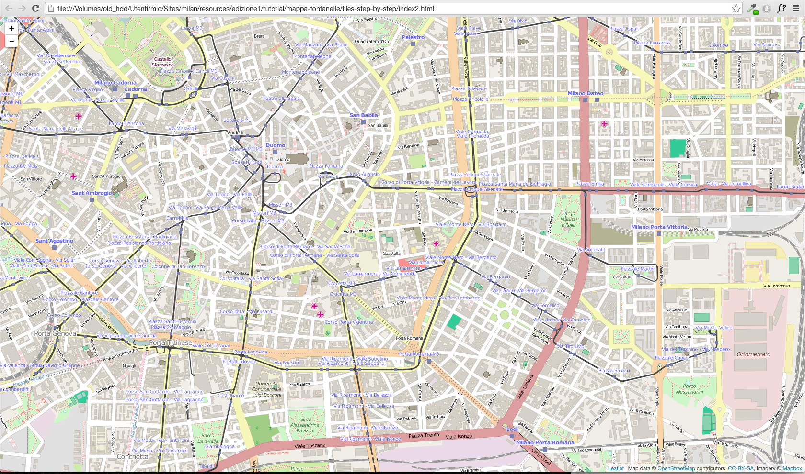
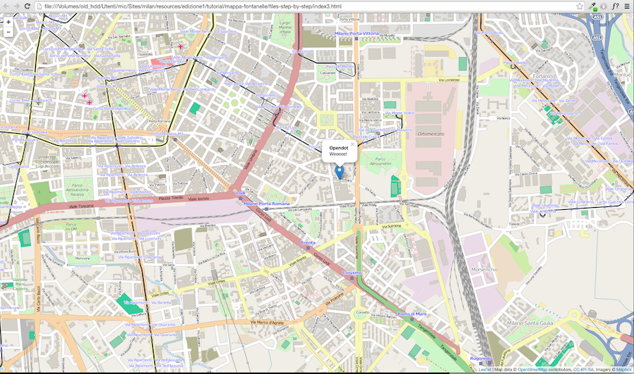
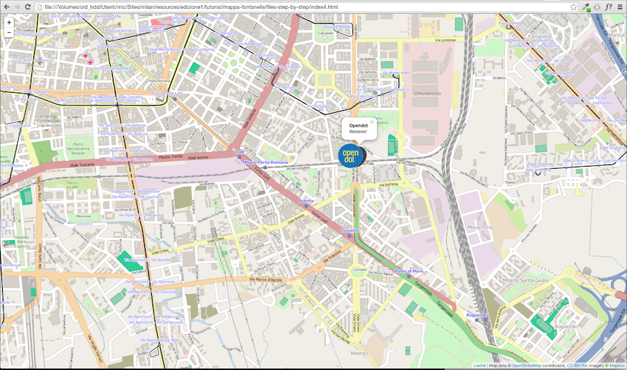
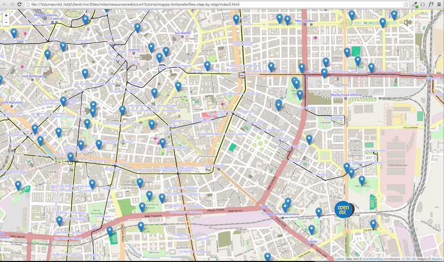
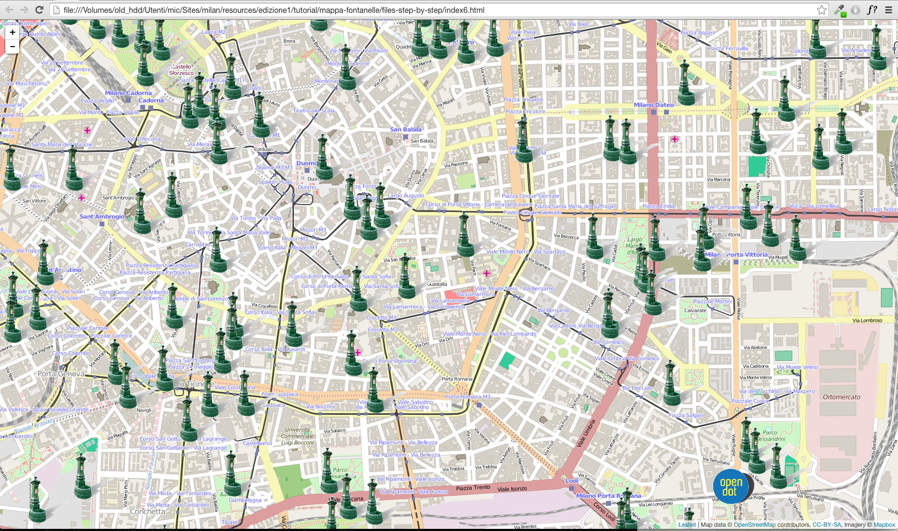

#LeafletJS tutorial
*Liberamente ispirato al tutorial di  [Zevross](http://zevross.com/blog/2014/10/28/tips-for-creating-leafleft-js-maps/) e ad altre mille fonti online..*

Questa cartella contiene i file ed i dati necessari per il tutorial su Leaflet.
Scaricala come .zip dal bottone di lato a dx, o tramite ```git clone```  
La pagina qui di seguito è scarsamente commentata di proposito, in quanto pensata come accompagnamento ad una spiegazione orale del tutorial.

#Step 1 - Prepariamo la pagina

Apriamo il file ```index.html``.
Per prima cosa andiamo a caricare la libreria Leaflet (file con estensione .js), insieme con il relativo foglio di stile (estensione .css).  
Per fare questo aggiungiamo i link agli scripts necessari in fondo al file, ma prima della chiusura del ```body``` (cioè prima del tag ```</body>```) :

		<script src="http://cdn.leafletjs.com/leaflet-0.7.3/leaflet.js"></script>
		<link rel="stylesheet" href="http://cdn.leafletjs.com/leaflet-0.7.3/leaflet.css" />


Poi aggiungiamo il codice per definire lo stile della pagina e della mappa (dimensioni, posizione ecc..). Per fare questo usiamo un tag particolare ```<style></style>```dentro cui mettere il codice. Questo tag ed il suo contenuto vanno messi all'interno dell'```<header></header>```

	
		body { margin:0; padding:0; }
		#map { position:absolute; top:0; bottom:0; width:100%; }
	

 Solitamente è buona pratica separare il codice relativo al contenuto (HTML) dallo stile (CSS), mettendo il secondo in un file a sè stante, ma per comodità questa volta terremo tutto insieme all'interno del tag ```<header></header>```.
 
Se vi siete persi, nessuna paura!  
Qui di seguito (ed in fondo ad ogni successivo paragrafo), potete trovare un file con il codice relativo scritto fino a questo punto.  
[** File step1**](./mappa-fontanelle/files-step-by-step/index1.html)

#Step 2 - La nostra prima web-map
Per prima cosa andiamo a definire il `div` che conterrà la nostra mappa, all'interno del ```<body></body>```.  
Cosi:

	<div id='map'></div>
	
Ora, con due righe di javascript chiediamo a Leaflet di creare una mappa dentro a questo div. Per fare questo useremo un tag simile a quello usato in precedenza per definire lo stile, ma pensato per contenre del codice javascript invece che del CSS. Inserite questa parte in fondo al file, dopo lo il link a Leaflet, e sempre prima della chiusura del tag ```body```.

    <script >

		//creo una mappa con relativa posizione e zoom iniziali
		 var map = L.map('map').setView([45.4588, 9.2010], 15);

		//aggiungo un layer di sfondo, o Base Layer
		var baseLayer = L.tileLayer('http://{s}.tile.openstreetmap.org/{z}/{x}/{y}.png',{
				attribution: 'Map data &copy; <a href="http://openstreetmap.org">OpenStreetMap</a> contributors, <a href="http://creativecommons.org/licenses/by-sa/2.0/">CC-BY-SA</a>, Imagery © <a href="http://	mapbox.com">Mapbox</a>',
				maxZoom: 18
			}).addTo(map);

	</script>

Se tutto è andato bene, questo è quello che dovreste vedere:



Non è molto, ma è pur sempre un inzio..congratulatevi con voi stessi per aver creato la vostra prima mappetta web.

[** File step2**](./mappa-fontanelle/files-step-by-step/index2.html)	

#Step 3 - Creare un marker

E' ora di mettere qualche puntina su questa cartina. 
Per aggiungere un marker, Leaflet offre un metodo molto intuitivo tramite il costruttore ```L.marker([lat, lng])```.  
Questi necessita obbligatoriamente di un array di coordinate ```[Latitudine, Longitudine]```, oltre a disporre di alcuni metodi opzionali, come ```.bindPopup()``` per visualizzare un baloon sopra il marker.
Aggiungiamo quindi il seguente codice, di seguito a quello scritto in precedenza:

	// Oggetto marker
	var openDotMarker = L.marker([45.448198, 9.222020])
	    .bindPopup('<b>Opendot</b> <br> Weeeee!')
	    .openPopup()
	    .addTo(map);

Risultato:


[** File step3**](./mappa-fontanelle/files-step-by-step/index3.html)	

#Step 4 - Modificare un icona

Per personalizzare il marker è possibile modificare l'icona di default con una creata a piacere.  
Come prima cosa creiamo quindi una variabile 'icona' a cui associamo un oggetto costruito tramito il metodo ```L.icon()```. 
Notate che due proprietà di quest'oggetto, ovvero i campi ```iconUrl``` e ```shadowUrl``` sono proprio gli URL delle icone che voglio linkare, relativi rispettivamente all'immagine ed all'immagine della sua ombra, per creare una specie di effetto prospettico.
Le altre proprietà gestiscono le dimensioni delle icone.

		// Icona Marker
		var openDotIcon = L.icon({
		    iconUrl: 'img/opendot-marker.png',
		    shadowUrl: 'img/opendot-marker-shadow.png',
		    iconSize:     [80, 80], // size of the icon
		    shadowSize:   [80, 80], // size of the shadow
		    iconAnchor:   [0, 0], // point of the icon which will correspond to marker's location
		    shadowAnchor: [0, 0],  // the same for the shadow
		    popupAnchor:  [60, 15] // point from which the popup should open relative to the iconAnchor
		});
		
Una volta costruito l'oggetto 'icona', possiamo ricreare il marker, ma questa volta passandogli come parametro opzionale proprio la nostra icona customizzata. 
		
		var openDotMarker = L.marker([45.448198, 9.222020],
			{ icon: openDotIcon}) // NOTA: questa opzione non era presente nello step3
		    .bindPopup('<b>Opendot</b> <br> Weeeee!')
		    .openPopup()
		    .addTo(map); 

Risultato:


[** File step4**](./mappa-fontanelle/files-step-by-step/index4.html)

#Step 5 - GeoJSON FTW!

Di soli marker non si vive. 
Un' altra strada per mettere quindi dei dati su una mappa web, è quella di utilizzare il formato [GeoJSON](http://geojson.org/), diventato oramai di diritto uno degli standard più diffusi di scambio dati geospaziali (insieme al 'classico' formato proprietario ESRI shapefile).  
Di seguito un esempio di GeoJSON (da [geojson.org](http://geojson.org/) ):

	
	{
	  "type": "Feature",
	  "geometry": {
	    "type": "Point",
	    "coordinates": [125.6, 10.1]
	  },
	  "properties": {
	    "name": "Dinagat Islands"
	  }
	}

Esistono vari modi per caricare un file GeoJSON (es: AJAX, JQuery $.getJSON()..).  Noi useremo un metodo proprio di Leaflet.  

Per prima cosa richiamiamo il file contenente i dati, con un link posto dopo quello per richiamare Leaflet:
	
	<script src="http://cdn.leafletjs.com/leaflet-0.7.3/leaflet.js"></script>
    <link rel="stylesheet" href="http://cdn.leafletjs.com/leaflet-0.7.3/leaflet.css" />
    <!-- Dati -->
	<script src="data/fontanelle.js"> </script>

Fermiamoci un momento ed apriamo il file ```data/fontanelle.js```. Potete notare come il GeoJSON sia stato racchiuso nella variabile ```fontanelle```.  
In questo modo possiamo infatti passare comodamente tutti i dati in una volta sola, come unico parametro, alla funzione ```L.geojson()```. Sarà lei infattia costruire per noi il Feature Layer contenente i dati:

	// Dati GeoJSON
	var fontane = L.geoJson(fontanelle, {
		pointToLayer : function  (feature, latlng) {
			lat = feature.geometry.coordinates[0];
			lng = feature.geometry.coordinates[1];
			return L.marker([lng,lat]).bindPopup("Andiamo a bere al Bar del Drago Verde!");
		}
	}).addTo(map);

Un punto su cui fare attenzione è come nella funzione ```L.geojson()``` le singole ```features```di cui si compone l'insieme di dati vengono passati a ```pointToLayer()```. Questo perchè, a differenza di altre geometrie come linee e poligoni, per i punti, Leaflet di default disegna sempre dei marker. Fate ad esempio un confronto con il codice in [questa slide](http://luxembourgjs.github.io/leaflet-demo/#/15). Per maggiori informazioni su questo aspetto fare riferimenti a [questa pagina](). 

(**Nota tecnica**: Esistono inoltre varie tipologie di geometrie rappresentabili con la struttura dati GeoJSON: '*A geometry is a GeoJSON object where the type member's value is one of the following strings: "Point", "MultiPoint", "LineString", "MultiLineString", "Polygon", "MultiPolygon", or "GeometryCollection".*' [fonte:geojson.org](http://geojson.org/geojson-spec.html#geometry-objects) ).


Risultato:


[** File step5**](./mappa-fontanelle/files-step-by-step/index5.html)	

#Step 6 - GeoJSON FTW! pt.2

Analogamente a quanto fatto per un singolo marker, se volessimo quindi modficare l'aspetto dei dati, dovremo quindi creare una variabile contenete lo stile dell'icona con cui vestire i dati..

	// Icona GeoJSON
	var fontanella = L.icon ({
		iconUrl: 'img/vedovella.png',
		shadowUrl: 'img/vedovella-shadow.png',
	    iconSize:     [80, 93], // size of the icon
	    shadowSize:   [80, 93], // size of the shadow
	    iconAnchor:   [0, 0 ], // point of the icon which will correspond to marker's location
	    shadowAnchor: [0, 0],  // the same for the shadow
	    popupAnchor:  [45, 10] // point from which the popup should open relative to the iconAnchor
	});

..e  passarla come parametro alla funzione ```L.marker()```

	// Dati GeoJSON
	var fontane = L.geoJson(fontanelle, {
		pointToLayer : function  (feature, latlng) {
			lat = feature.geometry.coordinates[0];
			lng = feature.geometry.coordinates[1];
			return L.marker([lng,lat],
			 {icon: fontanella}) // NOTA: questa opzione non era presente prima
			 .bindPopup("Andiamo a bere al Bar del Drago Verde!");
		}
	}).addTo(map);

Risultato:


[** File step6**](./mappa-fontanelle/files-step-by-step/index6.html)	

#Step 7 - Layers Control

Dopo aver messo i dati su mappa pensiamo infine ad offire la possibilità all'utente di poterli gestire accendendoli e spegnendoli a piacimente. E magari potendo cambiando anche il layer di sfondo (Base Layer).  
Per farlo dobbiamo usare un piccolo menù che controlli la visibilità di Base Layers e Feature Layers.

Partiamo quindi inizializzando delle nuove variabili a cui associare due nuovi layer di sfondo:

	// Mapbox Streets
	//---------------
	// var mapboxTilesStreet = L.tileLayer('https://{s}.tiles.mapbox.com/v3/examples.map-i86nkdio/{z}/{x}/{y}.png', {
	//         attribution: '<a href="http://www.mapbox.com/about/maps/" target="_blank">Terms &amp; Feedback</a>'
	//     })
	
	// Mapbox Medieval
	//---------------
	// var mapboxTilesMedieval = L.tileLayer('https://{s}.tiles.mapbox.com/v3/spatial.b625e395/{z}/{x}/{y}.png', {
	//         attribution: '<a href="http://www.mapbox.com/about/maps/" target="_blank">Terms &amp; Feedback</a>'
	//     }); 

Notate come per questi due layer non sia stato usato il metodo ```.addTo(map)``` per aggiungerli al div della mappa. Questo perchè vogliamo tenerli spenti di default, e poterli accendere solo in un secondo momento (uno alla volta ), tramite il menù di controllo.

Ora costruiamo due oggetti in cui salvare i riferimenti rispettivamente ai BaseLayers ed ai FeatureLayers, e che passeremo alla funzione ```L.control.layers()``` responsabile della creazione del menù.

		// Creo due oggetti con i riferimenti rispettivamente ai BaseLayers ed ai FeatureLayers
		var baseMaps={
			"Sfondo OSM": baseLayer,
			"Sfondo Mapbox Streets": mapboxTilesStreet,
			"Sfondo Mapbox Medieval": mapboxTilesMedieval
		};
		var featureLayers={
			"Vedovelle": fontane,
			"Logo Opendot" : openDotMarker
		};
		// Creo i controlli
		L.control.layers(baseMaps, featureLayers).addTo(map);
		// Per un metodo moolto più succinto (che usa però Mapbox.js) guardare questo link: https://www.mapbox.com/mapbox.js/example/v1.0.0/toggle-baslayers/

Se anche questo passaggio è andato a buon fine, dovreste trovare un menù in alto a dx con cui poter 	controllare i vostri layers.

Risultato:


[** File step7**](./mappa-fontanelle/files-step-by-step/index7.html)	

#[OPZIONALE]: Solo per i mappatori più tenaci(sopravvissuti)

#Step 8 - Plugins: Marker Clusterer

Leaflet è un libreria semplicissima e snella, ma al tempo stesso in grado di offrire moltissime funzionalità, grazie all'enorme numero di plugins sviluppati dall comunità.  

A titolo d'esempio vediamo come installare ed utilizzare un plugin, Leaflet [MarkerClusterer](https://github.com/Leaflet/Leaflet.markercluster), per aggregare le fontanelle in cluster, al variare del livello di zoom.

Come prima cosa linkiamo la libreria ```leaflet.markercluster``` come qualsiasi altro script js (è un qualsiasi script javascript!):

	<script src="http://cdn.leafletjs.com/leaflet-0.7.3/leaflet.js"></script>
    <link rel="stylesheet" href="http://cdn.leafletjs.com/leaflet-0.7.3/leaflet.css" />
    <!-- leaflet.markercluster -->
    <link rel="stylesheet" href="js/leaflet.markercluster/leaflet.markercluster.js" />
    <!-- Dati -->
	<script src="data/fontanelle.js"> </script> 

Dopodichè  seguiamo le istruzioni riporate sulla repo di [MarkerClusterer](https://github.com/Leaflet/Leaflet.markercluster) e creiamo un nuovo oggetto ```MarkerClusterGroup```, a cui passiamo le features del layer ```fontane```. Da ultimo aggiungiamo lo stesso sulla mappa.

	var markers = new L.MarkerClusterGroup();
	markers.addLayer(fontane);
	//... Add more layers ...
	map.addLayer(markers);

Attenzione! L'ultimo passaggio è ora togliere il metodo ```addTo(map)``` da ```L.geojson(fontane)```, altrimenti finirei con il caricare due volte lo stesso layer (uno all'inzio uso il GeoJSON per creare il layer di fontanelle, ed uno ora tramite markerClusterer)

Voilà:


[** File step8**](./mappa-fontanelle/files-step-by-step/index8.html)	


#  ~ Fin ~